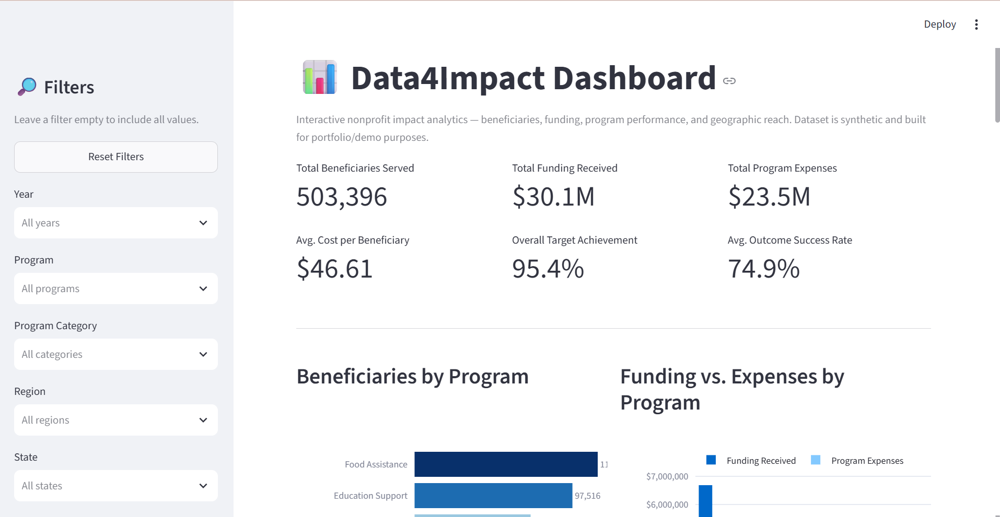

# Data4Impact Dashboard

An end-to-end data analytics project that transforms raw, messy nonprofit
program data into a cleaned SQLite database and an interactive dashboard —
showing how many people are served, how funding is distributed, how programs
compare across outcomes and cost efficiency, and where impact is growing.

### 🚀 Live Dashboard

**[View the Interactive Data4Impact Dashboard](https://data4impact-dashboard.streamlit.app)**

**Raw CSV → Pandas Data Cleaning → Clean CSV → SQLite Database → Analysis → KPIs → Interactive Dashboard → Business Insights**

> **Note:** The dataset used in this project is entirely **synthetic**,
> generated with `src/generate_data.py` for portfolio/demo purposes. It does
> not represent a real organization.

---

## Business Problem

Nonprofit organizations manage limited funding across multiple programs and
need to answer questions that donors, boards, and program staff all care
about: How many people are we actually reaching? Is funding going where it
has the most impact? Which programs are cost-efficient, and which are
falling short of their goals? Without a structured way to track this,
organizations risk misallocating funding, missing underperforming programs,
and struggling to report impact to stakeholders. This project builds the
analytics pipeline and dashboard a Data Analyst would create to answer those
questions with data instead of guesswork.

## Project Objective

This project helps a nonprofit stakeholder quickly understand:

- How many beneficiaries are served, in total and by program
- How funding is distributed and utilized across programs
- Which programs achieve the strongest outcomes and cost efficiency
- How performance trends over time and across regions
- Which programs may need review or additional support

## Dashboard Preview



## Key Features

- **CSV ingestion** — synthetic nonprofit program data generated and saved as CSV
- **Data cleaning** — a documented Pandas pipeline that removes duplicates, handles missing values, standardizes text, validates numeric ranges, and builds derived KPI columns
- **SQL database** — cleaned data loaded into SQLite with an explicit schema and used as the dashboard's analytical data source
- **SQL analysis** — 12 analytical queries covering aggregation, filtering, CTEs, `CASE WHEN` logic, and year-over-year trends
- **KPI tracking** — top-line KPI cards summarizing organizational performance
- **Interactive filtering** — sidebar filters by year, program, category, region, and state
- **Plotly visualization** — 8 charts covering programs, funding, trends, geography, and cost efficiency
- **Business insights** — plain-language insights calculated dynamically from the (filtered) data

## Tech Stack

Python | SQL | SQLite | Pandas | Streamlit | Plotly

## Dataset

The dataset is synthetic nonprofit program-activity data spanning
**2022–2025**, covering **7 programs** (Education Support, Food Assistance,
Healthcare Access, Housing Support, Youth Development, Job Training,
Community Outreach) across **4 regions** and **12 states**.

Each row represents one program's monthly activity report, including:

| Field | Description |
|---|---|
| `record_id` | Unique row identifier |
| `date`, `year`, `month` | Reporting period |
| `program_name`, `program_category`, `program_status` | Program identity |
| `region`, `state` | Geographic location |
| `beneficiaries_served`, `target_beneficiaries` | People served vs. goal |
| `funding_received`, `program_expenses` | Financials |
| `volunteer_hours`, `number_of_volunteers` | Volunteer activity |
| `satisfaction_score` (1–5), `outcome_success_rate` (%) | Program quality/outcomes |

The **raw** dataset (`data/raw/nonprofit_impact_raw.csv`, 1,648 rows)
intentionally includes realistic data-quality issues — missing values,
duplicate rows, inconsistent capitalization (`'FOOD ASSISTANCE'` vs `'food
assistance'`), and a few invalid values (negative counts, out-of-scale
scores) — which are resolved in the **cleaned** dataset
(`data/processed/nonprofit_impact_clean.csv`, 1,608 rows).

## Data Cleaning

`src/data_cleaning.py` performs, in order:

1. **Duplicate removal** — drops exact duplicate rows (double-submitted reports)
2. **Text standardization** — normalizes `program_name` and `region` to consistent canonical values regardless of capitalization/spacing
3. **Missing value handling** — drops rows missing `region` (required for geographic analysis); imputes `funding_received` with the per-program median, and `volunteer_hours`/`satisfaction_score` with the overall median
4. **Type conversion** — parses `date` to datetime, casts IDs/counts to integers
5. **Numeric validation** — converts negative counts/dollar amounts to their absolute value; clips `satisfaction_score` to 1–5 and `outcome_success_rate` to 0–100%
6. **Derived metrics** — creates `cost_per_beneficiary`, `funding_utilization_rate`, `target_achievement_rate`, `funding_remaining`, and `beneficiaries_per_volunteer_hour`, each guarded against division-by-zero

## SQL Analysis

`sql/create_tables.sql` defines the `impact_metrics` table schema, and
`sql/analysis_queries.sql` contains 12 business-focused queries using
`GROUP BY`, `HAVING`, `CASE WHEN`, window functions (`LAG`), and CTEs.
Examples:

```sql
-- Which programs are outperforming the org-wide average outcome success rate?
WITH overall_avg AS (
    SELECT AVG(outcome_success_rate) AS avg_rate FROM impact_metrics
)
SELECT program_name, ROUND(AVG(outcome_success_rate), 2) AS program_avg_success_rate
FROM impact_metrics
GROUP BY program_name
HAVING AVG(outcome_success_rate) > (SELECT avg_rate FROM overall_avg)
ORDER BY program_avg_success_rate DESC;
```

```sql
-- Year-over-year beneficiary growth
SELECT year, SUM(beneficiaries_served) AS total_beneficiaries,
    ROUND((SUM(beneficiaries_served) - LAG(SUM(beneficiaries_served)) OVER (ORDER BY year))
        * 100.0 / NULLIF(LAG(SUM(beneficiaries_served)) OVER (ORDER BY year), 0), 2) AS yoy_growth_pct
FROM impact_metrics
GROUP BY year ORDER BY year;
```

## KPIs

The dashboard's top-line KPI cards are: **Total Beneficiaries Served**,
**Total Funding Received**, **Total Program Expenses**, **Average Cost per
Beneficiary**, **Overall Target Achievement %**, and **Average Outcome
Success Rate**. Every KPI is recalculated live from whatever data the
current sidebar filters select.

## Dashboard

Built with **Streamlit** + **Plotly**, the dashboard loads its analytical data from the SQLite database and includes:

- **Sidebar filters** — Year, Program, Program Category, Region, and State, with an option to reset all filters
- **KPI cards** — the six metrics above, formatted professionally (e.g. `$2.4M`, `12,450`)
- **8 visualizations** — Beneficiaries by Program, Funding vs. Expenses, Impact Over Time, Program Success Rate, Geographic Impact, Funding Distribution, Target vs. Actual, and Cost Efficiency
- **Key Insights** — plain-language observations generated dynamically from the currently filtered data

## Key Insights

*Calculated from the full, unfiltered dataset stored in SQLite. The dashboard recalculates these insights dynamically when filters are applied.*

- **Food Assistance** serves the most beneficiaries overall, with **113,139** people served across the full 2022–2025 period.
- The **Midwest** region saw the strongest regional growth, up **32.9%** in beneficiaries served from 2022 to 2025.
- **Housing Support** has the highest average cost per beneficiary, at **$52.97** per person served.
- Organization-wide, total beneficiaries served **grew 24.5%**, from 113,240 in 2022 to 141,040 in 2025.
- **Education Support** makes the most efficient use of volunteer time, serving **1.54** beneficiaries per volunteer hour.
- Across all programs, overall target achievement sits at **95.4%**, and the average outcome success rate is **74.9%**.

## Project Structure

```
Data4Impact-Dashboard/
├── README.md
├── requirements.txt
├── .gitignore
├── app.py
├── data/
│   ├── raw/
│   │   └── nonprofit_impact_raw.csv
│   └── processed/
│       └── nonprofit_impact_clean.csv
├── database/
│   └── data4impact.db
├── sql/
│   ├── create_tables.sql
│   └── analysis_queries.sql
├── src/
│   ├── generate_data.py
│   ├── data_cleaning.py
│   ├── database.py
│   └── analysis.py
├── assets/
│   └── dashboard_preview.png
└── notebooks/
    └── exploratory_analysis.ipynb
```

## How to Run Locally

```bash
git clone https://github.com/anya-siri/Data4Impact-Dashboard.git
cd Data4Impact-Dashboard
python -m venv venv
```

Activate the virtual environment:

```bash
# Windows
venv\Scripts\activate

# macOS/Linux
source venv/bin/activate
```

Install dependencies and build the data pipeline:

```bash
pip install -r requirements.txt

python src/generate_data.py     # generates data/raw/nonprofit_impact_raw.csv
python src/data_cleaning.py     # generates data/processed/nonprofit_impact_clean.csv
python src/database.py          # builds database/data4impact.db from the cleaned CSV
```

Launch the dashboard:

```bash
streamlit run app.py
```

The dashboard will open automatically at `http://localhost:8501`.

## Skills Demonstrated

- SQL (aggregation, filtering, `CASE WHEN`, CTEs, window functions)
- Data Cleaning
- Data Analysis
- Exploratory Data Analysis
- KPI Development
- Data Visualization
- Dashboard Development
- Business Analysis
- Data Storytelling
- Python / Pandas
